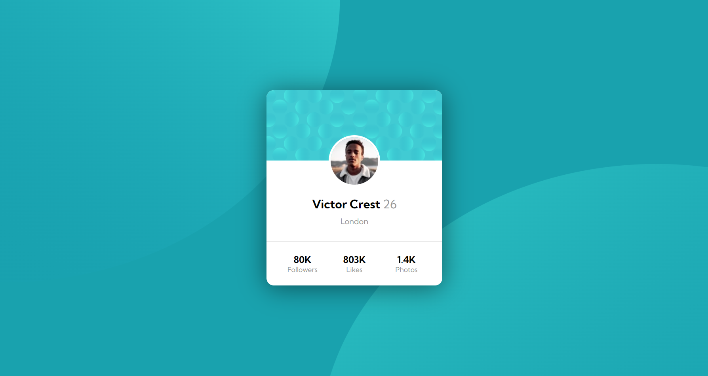

# Frontend Mentor - Profile card component solution

This is a solution to the [Profile card component challenge on Frontend Mentor](https://www.frontendmentor.io/challenges/profile-card-component-cfArpWshJ). Frontend Mentor challenges help you improve your coding skills by building realistic projects. 

## Table of contents

- [Overview](#overview)
  - [The challenge](#the-challenge)
  - [Screenshot](#screenshot)
  - [Links](#links)
- [My process](#my-process)
  - [Built with](#built-with)
  - [What I learned](#what-i-learned)
- [Author](#author)

## Overview

### The challenge

Users should be able to:

- View the optimal layout depending on their device's screen size
- See hover states for interactive elements

### Screenshot

### Links

- Solution URL: []
- Live Site URL: []

### Built with

- Semantic HTML5 markup
- CSS custom properties
- Flexbox

### What I learned

learned more about media query, responsiveness and backgrounds!

## Author

- Frontend Mentor - [https://www.frontendmentor.io/profile/IFafaa]
- GitHub - [https://github.com/IFafaa]
- Linkedin - [https://www.linkedin.com/in/fabrício-lima-a09333216/]
